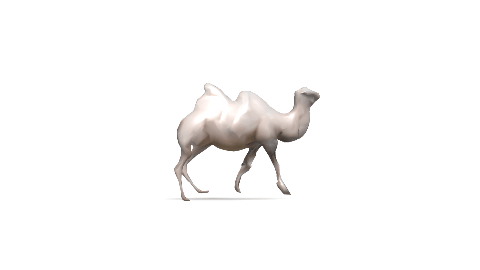

# LASR

## Installation
### Build with conda
```
conda env create -f lasr.yml
conda activate lasr
# install softras
cd third_party/softras; python setup.py install; cd -;
# install manifold remeshing
git clone --recursive -j8 git://github.com/hjwdzh/Manifold; cd Manifold; mkdir build; cd build; cmake .. -DCMAKE_BUILD_TYPE=Release;make; cd ../../
```
For docker installation, please see [install.md](./docs/install.md)

## Data preparation
Create folders to store data and training logs
```
mkdir log; mkdir tmp; 
```

<details><summary>Synthetic data</summary>

To render {silhouette, flow, rgb} observations of spot.
```
python scripts/render_syn.py
```
</details>


<details><summary>Real data (DAVIS)</summary>

First, download [DAVIS 2017 trainval set](https://data.vision.ee.ethz.ch/csergi/share/davis/DAVIS-2017-trainval-Full-Resolution.zip) and 
copy `JPEGImages/Full-Resolution` and `Annotations/Full-Resolution` folders of *DAVIS-camel* into the according folders in `database`.
```
cp ...davis-path/DAVIS/Annotations/Full-Resolution/camel/ -rf database/DAVIS/Annotations/Full-Resolution/
cp ...davis-path/DAVIS-lasr/DAVIS/JPEGImages/Full-Resolution/camel/ -rf database/DAVIS/JPEGImages/Full-Resolution/
```
Then download pre-trained VCN optical flow:
```
pip install gdown
mkdir ./lasr_vcn
gdown https://drive.google.com/uc?id=139S6pplPvMTB-_giI6V2dxpOHGqqAdHn -O ./lasr_vcn/vcn_rob.pth
```
Run VCN-robust to predict optical flow on DAVIS camel video:
```
bash preprocess/auto_gen.sh camel
```
</details>

<details><summary>Your own video</summary>

You will need to download and install detectron2 to obtain object segmentations as instructed below.
```
python -m pip install detectron2 -f \
  https://dl.fbaipublicfiles.com/detectron2/wheels/cu110/torch1.7/index.html
```

First, use any video processing tool (such as ffmpeg) to extract frames into `JPEGImages/Full-Resolution/name-of-the-video`.
```
mkdir database/DAVIS/JPEGImages/Full-Resolution/pika-tmp/
ffmpeg -ss 00:00:04 -i database/raw/IMG-7495.MOV -vf fps=10 database/DAVIS/JPEGImages/Full-Resolution/pika-tmp/%05d.jpg
```
Then, run pointrend to get segmentations:
```
cd preprocess
python mask.py pika path-to-detectron2-root; cd -
```

Assuming you have downloaded VCN flow in the previous step, run flow prediction:
```
bash preprocess/auto_gen.sh pika
```
</details>

## Single video optimization
<details><summary>Synthetic spot</summary>
Next, we want to optimize the shape, texture and camera parameters from image observartions.
Optimizing spot takes ~20min on a single Titan Xp GPU.

```
bash scripts/spot3.sh
```

To render the optimized shape, texture and camera parameters
```
bash scripts/extract.sh spot3-1 10 1 26 spot3 no no
python render_vis.py --testdir log/spot3-1/ --seqname spot3 --freeze --outpath tmp/1.gif
```
</details>

<details><summary>DAVIS camel</summary>

Optimize on camel observations. 
```
bash scripts/template.sh camel
```

To render optimized camel
```
bash scripts/render_result.sh camel
```
</details>

<details><summary>Costumized video (Pika)</summary>

Similarly, run the following steps to reconstruct pika
```
bash scripts/template.sh pika
```

To render reconstructed shape
```
bash scripts/render_result.sh pika
```
</details>

<details><summary>Monitor optimization</summary>

To monitor optimization, run
```
tensorboard --logdir log/
```

</details>

### Example outputs

<p align="center"> 

 
</p>

<details><summary>Evaluation</summary>

Run the following command to evaluate 3D shape accuracy for synthetic spot.
```
python scripts/eval_mesh.py --testdir log/spot3-1/ --gtdir database/DAVIS/Meshes/Full-Resolution/syn-spot3f/
```

Run the following command to evaluate keypoint accuracy on [BADJA](https://github.com/benjiebob/BADJA).
```
python scripts/eval_badja.py --testdir log/camel-5/ --seqname camel
```
</details>

## Additional Notes

<details><summary>Other videos in DAVIS/BAJDA</summary>

Please refer to [data preparation](#data-preparation) and [optimization](#single-video-optimization) of the camel example, and modify camel to other sequence names, such as dance-twirl.
We provide config files the `configs` folder.

</details>

<details><summary>Synthetic articulated objects </summary>

To render and reproduce results on articulated objects (Sec. 4.2), you will need to purchase and download 3D models [here](https://www.turbosquid.com/3d-models/3d-rigged-puppy-animations-model-1482772).
We use blender to export animated meshes and run `rendera_all.py`:
```
python scripts/render_syn.py --outdir syn-dog-15 --nframes 15 --alpha 0.5 --model dog
```

Optimize on rendered observations
```
bash scripts/dog15.sh
```

To render optimized dog
```
bash scripts/render_result.sh dog
```
</details>

<details><summary>Batchsize</summary>

The current codebase is tested with batchsize=4. Batchsize can be modified in `scripts/template.sh`.
Note decreasing the batchsize will improive speed but reduce the stability.

</details>

<details><summary>Distributed training</summary>

The current codebase supports single-node multi-gpu training with pytorch distributed data-parallel.
Please modify `dev` and `ngpu` in `scripts/template.sh` to select devices.

</details>


## Acknowledgement

The code borrows the skeleton of [CMR](https://github.com/akanazawa/cmr)

External repos:
- [SoftRas](https://github.com/ShichenLiu/SoftRas)
- [PerceptualSimilarity](https://github.com/richzhang/PerceptualSimilarity)
- [Manifold](https://github.com/hjwdzh/Manifold)
- [Chamfer3D](https://github.com/ThibaultGROUEIX/ChamferDistancePytorch)
- [VCN-robust](https://github.com/gengshan-y/rigidmask)

External data:
- [BADJA joint annotation](https://github.com/benjiebob/BADJA)
- [Keenan's 3D model repo (spot)](https://www.cs.cmu.edu/~kmcrane/Projects/ModelRepository)

### Citation

To cite our paper,
```
@inproceedings{yang2021lasr,
  title={LASR: Learning Articulated Shape Reconstruction from a Monocular Video},
  author={Yang, Gengshan 
      and Sun, Deqing
      and Jampani, Varun
      and Vlasic, Daniel
      and Cole, Forrester
      and Chang, Huiwen
      and Ramanan, Deva
      and Freeman, William T
      and Liu, Ce},
  booktitle={CVPR},
  year={2021}
}  
```
